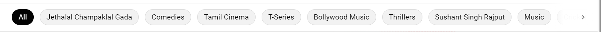
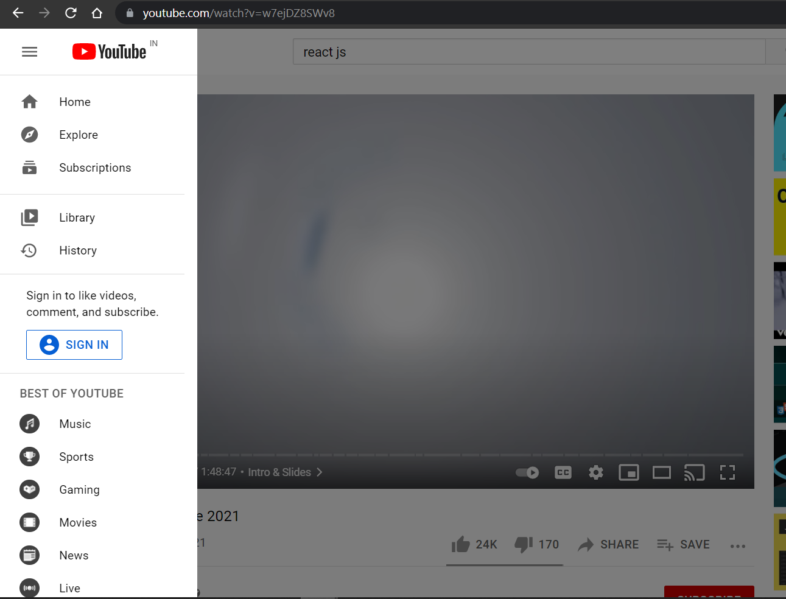
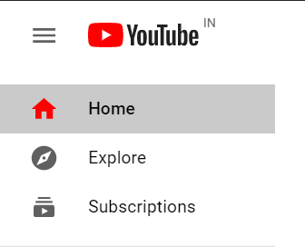
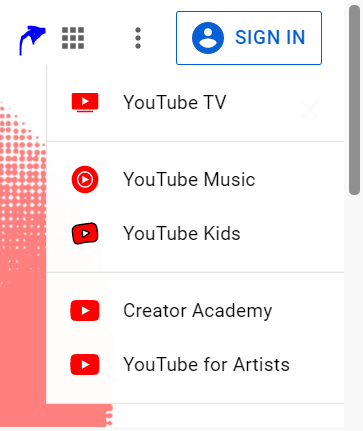
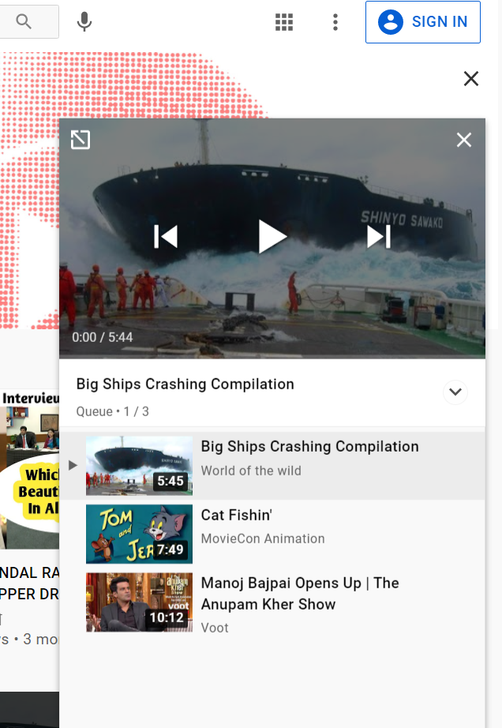

# 📝 Assignments

1. [ ] Open your first PR to this repository.
2. [ ] Complete YouTube Clone project. Project Code [here](https://github.com/salikadave/react-youtube-clone). Follow the commit history if you don't know where to begin.
3. [ ] Complete the "Chips" Feature
       
       A `<Chip>` component is already available for you in the starter project. You must complete the container such that you make use of the `<Chip>` component only once and the number of chips can be dynamically rendered.
4. [ ] Make this chip container horizontally scrollable, as close as the one on the YouTube website.
5. [ ] Complete the sidebar on the Watch Page/YouTube Video Player Page.

 

6. [ ] Add a prop called `isColored` that decides whether an icon should be printed in the trademark red color. Indicate to the user that the Home Page is the current page.

   
7. [ ] Add a [Menu list](https://material-ui.com/components/menus/#menus) when the user clicks on the more apps icon in the top right corner of the home page. More points for making it as close as possible to the original!

 
      
8. [ ] Create a component that displays the video player and the Queue of videos on the home page itself. Make use of the `QueueContext` that we created to display the queue on the `Watch Page`.

   <!-- _This space will be updated soon_ -->
